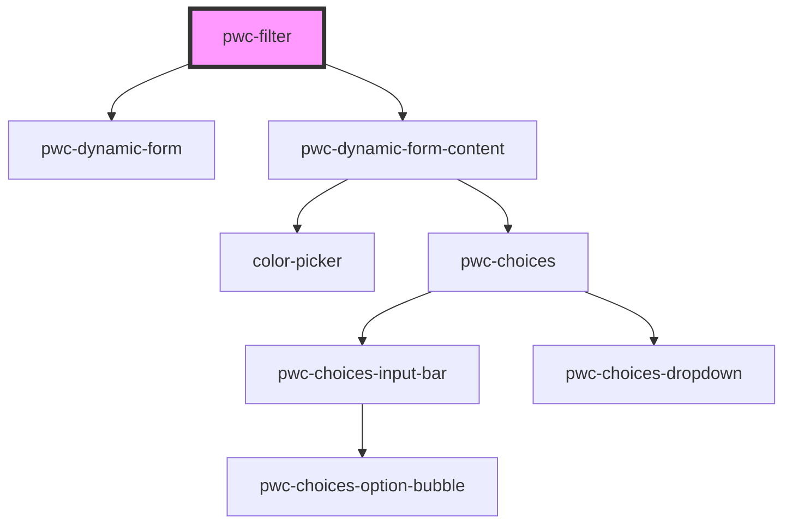

# pwc-filter

<!-- Auto Generated Below -->

## Properties

| Property | Attribute | Description | Type                     | Default     |
| -------- | --------- | ----------- | ------------------------ | ----------- |
| `data`   | `data`    |             | `object[] \| string`     | `undefined` |
| `items`  | `items`   |             | `ItemConfig[] \| string` | `undefined` |

## Events

| Event           | Description | Type                                     |
| --------------- | ----------- | ---------------------------------------- |
| `filterChanged` |             | `CustomEvent<FilterChangedEventPayload>` |

## Methods

### `filter() => Promise<object[]>`

#### Returns

Type: `Promise<object[]>`

## Dependencies

### Depends on

- pwc-dynamic-form
- pwc-dynamic-form-content

### Graph

----------------------------------------------

*Built with [StencilJS](https://stenciljs.com/)*
