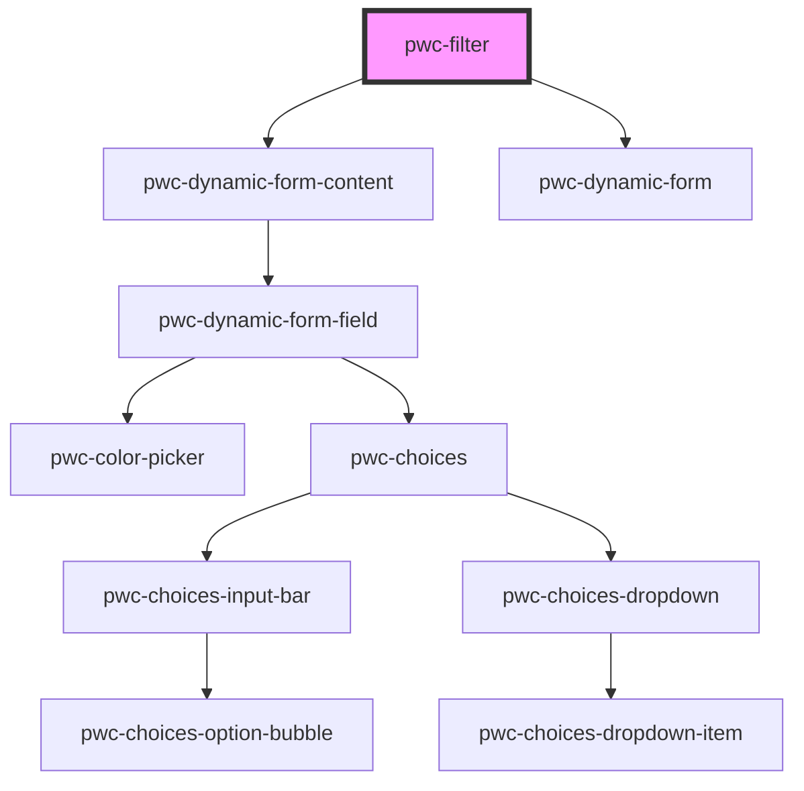

# pwc-filter

<!-- Auto Generated Below -->

## Properties

| Property                           | Attribute                              | Description                                                                                                                 | Type                     | Default                                             |
| ---------------------------------- | -------------------------------------- | --------------------------------------------------------------------------------------------------------------------------- | ------------------------ | --------------------------------------------------- |
| `data`                             | `data`                                 |                                                                                                                             | `object[] \| string`     | `undefined`                                         |
| `handleNullAndUndefinedSeparately` | `handle-null-and-undefined-separately` | If this is true, the same string representation is assigned to null and undefined values for generated pwc-choices options. | `boolean`                | `this     .defaultHandleNullAndUndefinedSeparately` |
| `items`                            | `items`                                |                                                                                                                             | `ItemConfig[] \| string` | `undefined`                                         |

## Events

| Event           | Description | Type                                     |
| --------------- | ----------- | ---------------------------------------- |
| `filterChanged` |             | `CustomEvent<FilterChangedEventPayload>` |

## Methods

### `addItem(config: ItemConfig) => Promise<void>`

#### Returns

Type: `Promise<void>`

### `filter() => Promise<object[]>`

#### Returns

Type: `Promise<object[]>`

### `removeItem(id: string) => Promise<ItemConfig[]>`

#### Returns

Type: `Promise<ItemConfig[]>`

## Dependencies

### Depends on

- pwc-dynamic-form-content
- pwc-dynamic-form

### Graph

----------------------------------------------

*Built with [StencilJS](https://stenciljs.com/)*
